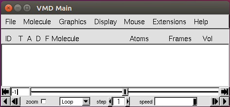
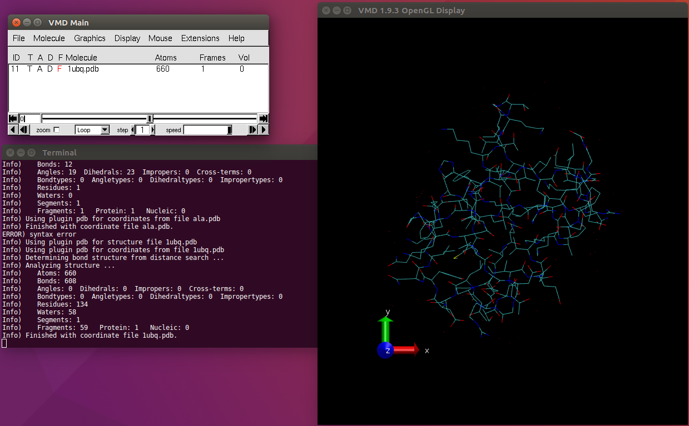

<script src="https://cdnjs.cloudflare.com/ajax/libs/mathjax/2.7.0/MathJax.js?config=TeX-AMS-MML_HTMLorMML" type="text/javascript"></script>


### Welcome to our first tutorial!

In this session we will learn the basic of visualising a protein,
play with it and a recap of what you will need.[^1]

[^1]: This tutorial is adapted from [Using VMD](https://www.ks.uiuc.edu/Training/Tutorials/vmd/vmd-tutorial.pdf)

# Software
Let's start from the basic. For this tutorial we will use [VMD](https://www.ks.uiuc.edu/Research/vmd/), a visualisation program
that will allow us to render pretty images and analyse our simulations as well.
The computers provided to you already have VMD installed.
If you want the software on your own laptop, you can download it from [download VMD](https://www.ks.uiuc.edu/Development/Download/download.cgi?PackageName=VMD)
with a simple registration. Choose the version `1.9.3` suitable for your operating system.


# Bash
The *Bourne Again SHell* (BASH) Let's have a quick overview of the basic of `bash` in the meanwhile.

On Ubuntu type `ctrl-alt-T` in order to open a terminal. For macOS, you should find the **Terminal** in the _Applications/_ folder.
For Windows users, use the lab computers.

To check what `bash` you are using, type `which bash`. You should see something like
<p class="prompt prompt-shell">/bin/bash <br> /usr/bin/bash</p>

Let's have a walk into the computer filesystem. First of all, type `pwd` (**p**rint **w**orking **d**irectory). The output should be something like:
<p class="prompt prompt-shell"> /home/your_username </p>

What is inside your folder? Type `ls` (**l**i**s**t) and read the output.
<p class="prompt prompt-question">What changes if you type "ls -lh"? (without "")</p>

Let's create now a new directory for the course.
<p class="prompt prompt-shell">$ mkdir QCB_course</p>
<p class="prompt prompt-attention">Bash does not like white spaces, so use the underscore `_`.</p>

With `pwd` we can see that we are still in the `/home` directory. Try!

Let's go inside
`QCB_course`.
<p class="prompt prompt-shell">$ cd QCB_course</p>

To create an empty file, you can use `touch dummy_file.sh`. We will see in a minute
what the extension `.sh` means.

We have no interest in the `dummy_file.sh`, so we can **r**e**m**ove it with:
<p class="prompt prompt-shell">$ rm dummy_file.sh</p>
Of course, we are all smart, but in order to avoid unwanted deletion, let's add a
small command to your `~/.bashrc` (the `.` at the beginning of a filename makes it "invisible").
First, let's make a backup copy of the file:
<p class="prompt prompt-shell">$ cd #to go into the home folder <br>
$ cp .bashrc .OLD_bashrc</p>
Guess what `cp` does.

Finally we can add our line:
<p class="prompt prompt-shell">$ echo "alias rm='rm -i'" >> .bashrc </p>
If we go into `~/QCB_course` folder, create a new file and remove it, we should be
asked for confirm. Right? (Do the same on a new terminal or type `source .bashrc`)

With `bash` we can perform some basic arithmetics.
Create a new file called `my_script.sh` and open it with a text editor.
<p class="prompt prompt-attention">Try to use an editor like ViM, Emacs or nano (without a GUI)</p>

Write the following text into the file and try to understand what it does:
```bash
#!/bin/bash
i=5
for j in {1..4}
do
  echo "Adding 1 to $j: $((j + 1))"
done

echo "Math (should) work! 5*4 = $((i*j))"

```

To launch this script:
<p class="prompt prompt-shell">$ bash my_script.sh </p>
You can also launch the commands with `./my_script.sh`, if your file is an executable.
List the content of your folder and then do:
<p class="prompt prompt-shell">$ chmod 700 my_script.sh</p>
If you "list" again, did somethin change?

<p class="prompt prompt-attention"> bash is not the only shell you have on your computer! </p>

To further learn about `bash`, feel free to search it on [Google](www.google.it).

# Installing VMD (optional)
Extract the folder, run the configuration, go into the `src/` folder and install VMD.
```bash
cd Downloads/
tar xvzf VMD_something.tar.gz
cd VMD_something
./config
cd src
```

Now you should be ready to go.

# Getting started

Download the [source file](). Move the `.tar.gz` archive into `QCB_course` and
untar it with
<p class="prompt prompt-shell">$ tar xvzf file.tar.gz <br>
$ rm -f file.tar.gz</p>
Now launch VMD:
<p class="prompt prompt-shell">$ vmd</p> and you should have the following:

<p align="center"> VMD graphical interface.</p>

If everything works, close it and let's define a common playground.

## Easy and fast recap
There are a lot of amino acids out there.


But only 20 of them are coded into our DNA. We will deal mainly with these residues,
but it is not uncommon to have acetylated residues especially in the _termini_.

"What is a _terminus_ or a residue or an amino acid?" I hear you ask.

Amino acids are the building block of proteins. If _isolated_, an amino acid
has an amine (-NH2)[^2] and a carboxyl (-COOH) group. If _linked_ with others to form
a polypeptide, they lose a hydrogen from the N-terminal (amine group) and an OH from the C-terminal (carboxyl group) and we have a residue. We will usually use **residue** without this distinction. _Ça va sans dire_, the first and the last residue have to be capped with the proper terminal end since they are not linked
from both sides.

[^2]: Under biological conditions, the N-group is protonated (-NH3+)


All amino acids have a Carbon, called carbon-alpha, where a functional group is
attached. This group is specific to each amino acid and it is called **sidechain**,
while the other (heavy) atoms, present in each residue, constitute the **backbone**.

Below we have an **Alanine** with different segments highlighted that exemplifies
the nomenclature just introduced.


<div align="center">
a) Alanine amino acid in Licorice with the C-alpha shown. b) Residue of the same amino acid. <br>
c) Backbone (bottom) and sidechain (top).<br>
</div>


Further information will be provided as we move deep in the course.

## In media re with VMD
VMD is a software for visualising and analysing molecular systems like proteins.
We will see a small subset of the available functionality of the program.
In this lesson we will focus on the visualisation of a protein and on the basics
of a scripting language called `Tcl` (read: _tickle_).

Let's go back to the shell. In your working folder you should have the following files:
<p class="prompt prompt-shell"> 1ubq.pdb equilibration.dcd pulling.dcd ubiquitin.psf </p>

Open VMD, typing `vmd`.
We will have three windows:
1. VMD Main
2. VMD Display
3. the Terminal

In the `VMD Display` our system will be draw.
`VMD Main` is a graphical interface for all the functionality we need.



`File`: load molecules, render them.
`Molecule`: actions on the loaded molecules.
`Graphics`: representation of the loaded structures.
`Display`: option for the `VMD Display`.
`Mouse`: actions that can be performed with the mouse.
`Extension`: collection of modelling and analysis tools.
`Help`: (really?).

Let's load a file containing the coordinate of a protein with the extension `.pdb`.
We will load a structure of the ubiquitin, a small protein that labels proteins that have to be degraded.
So _File -> New Molecule_ and browse `1ubq.pdb` and load it.
You will have something like this:



-- rotate R
-- translate T
-- scale S
-- center C

= to reset the view


# Further readings
[VMD User's Guide](https://www.ks.uiuc.edu/Research/vmd/current/ug.pdf)


---
# Notes
